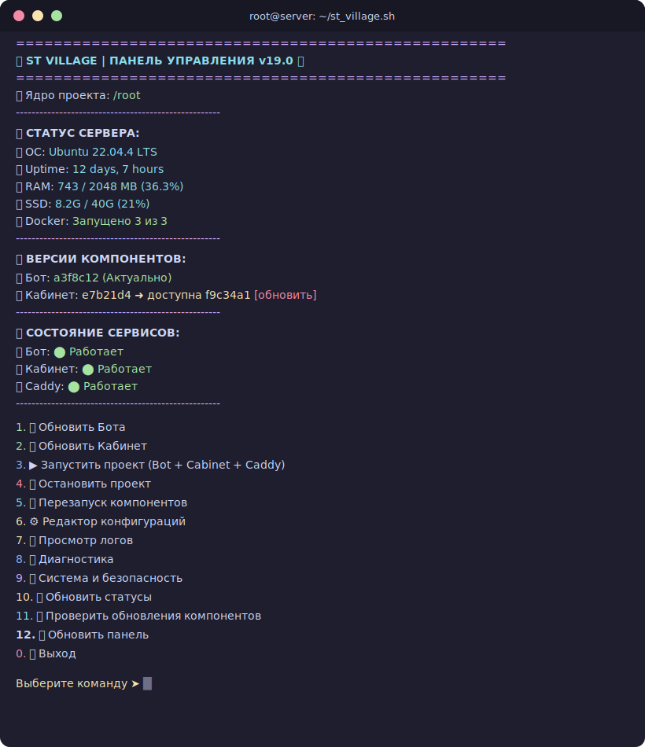

# 🚀 ST Village — Auto Install Bedolaga Bot

[](https://github.com/Reibik/Auto_Install-Bedolaga_Bot/releases)
[](LICENSE)
[](st_village.sh)
[](https://github.com/Reibik/Auto_Install-Bedolaga_Bot)
[](https://github.com/Reibik/Auto_Install-Bedolaga_Bot/commits/main)
[](https://github.com/Reibik/Auto_Install-Bedolaga_Bot)

Интерактивный bash-скрипт для автоматической установки и управления **[Bedolaga Telegram Bot](https://github.com/BEDOLAGA-DEV/remnawave-bedolaga-telegram-bot)** + **[Bedolaga Cabinet](https://github.com/BEDOLAGA-DEV/bedolaga-cabinet)** + **Caddy** (reverse proxy с автоматическим SSL).

> **Версия 19.0** — масштабный рефакторинг: скрипт уменьшен на 21% (2313 → 1819 строк), 13 хелпер-функций для дедупликации кода. См. [CHANGELOG.md](CHANGELOG.md) для полного списка изменений.

---

## 📑 Оглавление

- [📋 Что делает скрипт](#-что-делает-скрипт)
- [⚡ Быстрый старт](#-быстрый-старт)
- [📌 Требования](#-требования)
- [🏗 Архитектура](#-архитектура)
- [🔧 Настройка после установки](#-настройка-после-установки)
- [🖥 Панель управления](#-панель-управления)
- [📡 Мониторинг](#-мониторинг)
- [💾 Автоматические бэкапы](#-автоматические-бэкапы)
- [🛠 Ручной запуск бэкапа](#-ручной-запуск-бэкапа)
- [📥 Восстановление из бэкапа](#-восстановление-из-бэкапа)
- [🔄 Обновление компонентов](#-обновление-компонентов)
- [🔍 Диагностика](#-диагностика)
- [🛡 Безопасность](#-безопасность)
- [🔔 Telegram-уведомления](#-telegram-уведомления)
- [🚚 Миграция](#-миграция)
- [💿 Управление Swap](#-управление-swap)
- [❓ FAQ](#-faq)
- [📎 Связанные проекты](#-связанные-проекты)
- [💰 Поддержка](#-поддержка)
- [🤝 Вклад в проект](#-вклад-в-проект)
- [📄 Лицензия](#-лицензия)

---

## 📋 Что делает скрипт

**Установка и запуск:**
- ✅ Устанавливает Docker и все системные зависимости
- ✅ Клонирует репозитории бота и кабинета
- ✅ Генерирует конфигурации Caddy и docker-compose override
- ✅ Автоматически генерирует JWT-секреты при установке
- ✅ Предоставляет интерактивную панель управления для всех операций

**Настройка и конфигурация:**
- ✅ Интерактивные мастера настройки `.env` с валидацией
- ✅ Редактирование `.env` бота, кабинета, Caddyfile через `nano` или мастер

**Мониторинг и диагностика:**
- ✅ Автоматический health check каждые 10 мин. с Telegram-алертами
- ✅ Watchdog — авто-рестарт упавших контейнеров каждые 5 мин.
- ✅ DNS-валидация перед запуском Caddy (предотвращение проблем SSL)
- ✅ Логирование всех операций в файл с ротацией
- ✅ Диагностика сервисов: health check, DNS, порты, SSL

**Безопасность и уведомления:**
- ✅ UFW файрвол, Fail2ban (защита SSH)
- ✅ Telegram-уведомления о событиях (бэкапы, обновления, запуск)

**Обслуживание:**
- ✅ Восстановление из бэкапов, миграция между серверами
- ✅ Управление Swap, очистка Docker, полное удаление проекта

## ⚡ Быстрый старт

```bash
bash <(curl -fsSL https://raw.githubusercontent.com/Reibik/Auto_Install-Bedolaga_Bot/main/st_village.sh)
```

**Или вручную:**

```bash
curl -fsSL https://raw.githubusercontent.com/Reibik/Auto_Install-Bedolaga_Bot/main/st_village.sh -o /root/st_village.sh
chmod +x /root/st_village.sh
./st_village.sh
```

> **Требуется root.** Скрипт проверяет права при запуске.

## 📌 Требования

| Компонент | Минимум | Рекомендуется |
|-----------|---------|---------------|
| **ОС** | Ubuntu 20.04+ / Debian 11+ | Ubuntu 22.04 LTS |
| **RAM** | 1 GB | 2 GB |
| **Диск** | 5 GB свободно | 10 GB |
| **Права** | root | root |
| **Сеть** | Открытые порты 80 и 443 | Статический IP |
| **Домены** | 2 домена с A-записями | С настроенным DNS |

> Docker и Docker Compose устанавливаются автоматически, если не обнаружены.

## 🏗 Архитектура

```
Браузер → Caddy (80/443, auto-SSL)
              ├─ bot.example.com     → remnawave_bot:8080      (Backend API)
              └─ cabinet.example.com
                    ├─ /api/*        → remnawave_bot:8080      (Cabinet API, strip /api)
                    └─ /*            → cabinet_frontend:80      (React SPA)
```

Все контейнеры объединены в Docker-сеть `remnawave-network`.

### Структура файлов на сервере

```
/root/
├── bot/                        # Bedolaga Bot (клон репозитория)
│   ├── docker-compose.local.yml
│   └── .env
├── cabinet/                    # Bedolaga Cabinet (клон репозитория)
│   ├── docker-compose.yml
│   ├── docker-compose.override.yml  # Автогенерируется скриптом
│   └── .env
├── caddy/                      # Caddy reverse proxy
│   ├── docker-compose.yml          # Автогенерируется скриптом
│   └── Caddyfile                   # Автогенерируется скриптом
├── backups/                    # Резервные копии
└── st_village.sh               # Этот скрипт
```

## 🔧 Настройка после установки

После первого запуска скрипт клонирует репозитории и покажет инструкции. Необходимо заполнить 3 файла:

### 1. Конфигурация бота — `/root/bot/.env`

Обязательные переменные:

| Переменная | Описание |
|------------|----------|
| `BOT_TOKEN` | Токен бота от [@BotFather](https://t.me/BotFather) |
| `ADMIN_IDS` | Telegram ID администратора |
| `WEB_API_ENABLED=true` | Включить веб-сервер (обязательно для кабинета) |
| `CABINET_ENABLED=true` | Включить Cabinet API |
| `CABINET_ALLOWED_ORIGINS` | Домен кабинета, например `https://cabinet.example.com` |
| `CABINET_JWT_SECRET` | Секрет для JWT (`openssl rand -hex 32`) |
| `REMNAWAVE_API_URL` | URL панели Remnawave |
| `REMNAWAVE_API_KEY` | API ключ панели Remnawave |

Полный список переменных — в файле `.env.example` в репозитории бота.

### 2. Конфигурация кабинета — `/root/cabinet/.env`

| Переменная | Описание |
|------------|----------|
| `VITE_TELEGRAM_BOT_USERNAME` | Username бота без `@` |
| `VITE_API_URL` | Путь к API (по умолчанию `/api`) |
| `VITE_APP_NAME` | Название в шапке (по умолчанию `Cabinet`) |

### 3. Домены в Caddyfile — `/root/caddy/Caddyfile`

Замените `bot.example.com` и `cabinet.example.com` на ваши реальные домены:

```caddyfile
bot.example.com {
    encode gzip zstd
    reverse_proxy remnawave_bot:8080
}

cabinet.example.com {
    encode gzip zstd

    handle /api/* {
        uri strip_prefix /api
        reverse_proxy remnawave_bot:8080
    }

    handle {
        reverse_proxy cabinet_frontend:80
    }
}
```

> Caddy автоматически получает и обновляет SSL-сертификаты от Let's Encrypt.

### Запуск

После заполнения конфигов выберите **пункт 3** в главном меню панели.

> **Подсказка:** Вместо ручного редактирования `.env` можно использовать **мастера настройки** в меню «⚙️ Редактор конфигураций».

## 🖥 Панель управления

<p align="center">
  
</p>

### Возможности

| Функция | Описание |
|---------|----------|
| **Установка** | Автоматическое клонирование, подготовка `.env`, генерация Caddy-конфигов, автогенерация JWT-секрета |
| **Запуск / Остановка** | Запуск и остановка всех трёх сервисов одной командой с предварительной проверкой конфигурации и портов |
| **Перезапуск** | Перезапуск бота, кабинета или Caddy по отдельности или всех сразу |
| **Обновление** | Обновление бота и кабинета до последней версии из `main` с автопересборкой и Telegram-уведомлением |
| **Откат** | Откат бота или кабинета на предыдущий commit |
| **Мастера настройки** | Интерактивные визарды для `.env` бота, кабинета и доменов с валидацией формата |
| **Конфигурации** | Редактирование `.env` бота, `.env` кабинета, Caddyfile через `nano` или мастер |
| **Диагностика** | Health check сервисов, проверка DNS/портов/SSL-сертификатов, ресурсы контейнеров |
| **Логи** | Просмотр логов любого компонента в реальном времени |
| **Бэкапы** | Ручные и автоматические (ежедневные) бэкапы с ротацией + восстановление из бэкапа |
| **Миграция** | Экспорт/импорт конфигурации для переноса на другой сервер |
| **Безопасность** | Настройка UFW (файрвол), установка Fail2ban (защита SSH) |
| **Telegram-уведомления** | Уведомления в Telegram при бэкапах, обновлениях и запуске |
| **Управление Swap** | Создание/удаление swap-файла для серверов с малым объёмом RAM |
| **Очистка Docker** | Удаление неиспользуемых образов, контейнеров и томов |
| **Полное удаление** | Чистое удаление всех компонентов проекта с двойным подтверждением |
| **Самообновление** | Обновление самого скрипта панели |

## 📡 Мониторинг

Скрипт включает встроенную систему мониторинга, работающую через cron-задачи.

### Health Check (каждые 10 минут)

Включение через меню **9 → 10**. Cron-задача проверяет состояние всех контейнеров:

- Если контейнер в состоянии `unhealthy` или `exited` — отправляется Telegram-алерт
- Для работы требуются включённые Telegram-уведомления

```
*/10 * * * * /root/st_village.sh cron_health
```

### Watchdog (каждые 5 минут)

Включение через меню **9 → 11**. Автоматически перезапускает упавшие контейнеры:

- Проверяет контейнеры `remnawave_bot`, `cabinet_frontend`, `caddy`
- Если контейнер остановлен — выполняет `docker compose up -d` в соответствующей директории
- Отправляет Telegram-уведомление о каждом рестарте

```
*/5 * * * * /root/st_village.sh cron_watchdog
```

### Просмотр лога

Все операции скрипта записываются в `/root/st_village.log`. Лог автоматически ротируется при достижении 1 МБ. Просмотр доступен через меню **9 → 12**.

## 💾 Автоматические бэкапы

Включение через меню **9 → 2**. Cron-задача запускается в 03:00 ежедневно:

```
0 3 * * * /root/st_village.sh cron_backup
```

- Бэкапы хранятся в `/root/backups/`
- Хранится до 7 последних авто-бэкапов (ротация)
- Из бэкапа исключаются `.venv`, `__pycache__`, `node_modules`, `.git`
- При включенных уведомлениях — сообщение в Telegram после каждого бэкапа

## 🛠 Ручной запуск бэкапа

```bash
./st_village.sh
# Меню → 9 → 1
```

## 📥 Восстановление из бэкапа

Через меню **9 → 4**:

1. Показывается список доступных бэкапов с размером и датой
2. Выберите номер бэкапа
3. Текущее состояние автоматически сохраняется перед восстановлением
4. Сервисы останавливаются, файлы распаковываются
5. Предлагается сразу запустить проект

## 🔄 Обновление компонентов

При обновлении бота или кабинета скрипт:

1. Сохраняет текущий commit в `.last_commit`
2. Делает `git fetch` + `git reset --hard origin/main`
3. Пересобирает Docker-образы (`docker compose up -d --build`)
4. Отправляет Telegram-уведомление (если включены)

При необходимости — откат через меню **9 → 5/6**.

## 🔍 Диагностика

Меню **8** предоставляет инструменты для проверки работоспособности:

| Проверка | Описание |
|----------|----------|
| **Полная проверка** | Состояние контейнеров + HTTP-проверки доменов + DNS + порты |
| **DNS** | Проверка что домены из Caddyfile указывают на IP сервера |
| **Порты** | Проверка что порты 80/443 свободны или заняты Caddy |
| **SSL-сертификаты** | Срок действия сертификатов для каждого домена |
| **Ресурсы** | CPU, RAM, сеть для каждого контейнера проекта |
| **Конфигурация** | Валидация обязательных переменных в `.env` файлах |

Дашборд панели также показывает быстрый health-статус (🟢/🔴) для каждого сервиса.

## 🛡 Безопасность

Через меню **9 → 7/8**:

### UFW (файрвол)

- Автоматическая установка и настройка
- Открывает порты: SSH (22), HTTP (80), HTTPS (443)
- Блокирует все остальные входящие соединения

### Fail2ban

- Автоматическая установка и настройка
- Защита SSH от брутфорса
- Настройки: `maxretry=5`, `bantime=1 час`, `findtime=10 мин`

## 🔔 Telegram-уведомления

Включение через меню **9 → 9**. Использует `BOT_TOKEN` и `ADMIN_IDS` из `.env` бота.

Уведомления отправляются при:
- Создании бэкапа (ручного и автоматического)
- Обновлении компонентов
- Запуске проекта
- Полном удалении

## 🚚 Миграция

Через меню **9 → 15**:

### Экспорт

Создаёт компактный архив с конфигурациями (`.env` файлы, `Caddyfile`, `docker-compose.override.yml`).

### Импорт

1. Скопируйте архив миграции на новый сервер
2. Установите панель: `bash <(curl -fsSL ...)`
3. Выберите «Миграция → Импорт» и укажите путь к архиву
4. Репозитории клонируются автоматически, конфиги распаковываются

## 💿 Управление Swap

Через меню **9 → 13**. Полезно для серверов с 1 ГБ RAM:

- Показывает текущее состояние swap и объём RAM
- Создание swap-файла (2 ГБ или 4 ГБ)
- Автоматическая запись в `/etc/fstab`
- Удаление swap-файла

## ❓ FAQ

### Скрипт падает с ошибкой «Нет доступа к интерактивному терминалу»

Запускайте из обычной SSH-сессии, а не через `cron` или `nohup`.

### Caddy не получает сертификат

- Убедитесь, что порты 80 и 443 открыты (проверьте через **8 → 3**)
- Домены указывают на IP вашего сервера (проверьте через **8 → 2**)
- Не используйте `example.com` — замените на реальные домены
- Проверьте срок SSL через **8 → 4**

### Кабинет показывает ошибку CORS

Добавьте домен кабинета в `CABINET_ALLOWED_ORIGINS` в `/root/bot/.env` и перезапустите бот. Или используйте **мастер доменов** (меню **6 → 7**), который обновит и Caddyfile, и `CABINET_ALLOWED_ORIGINS` автоматически.

### Как перенести проект на другой сервер?

Используйте функцию **миграции** (меню **9 → 15**): экспорт конфигов → копирование на новый сервер → импорт.

### Серверу не хватает RAM

Создайте swap через меню **9 → 13**. Рекомендуется 2 ГБ для серверов с 1 ГБ RAM.

### 502 Bad Gateway

1. Проверьте, что бот запущен: `docker ps`
2. Проверьте, что все контейнеры в одной сети: `docker network inspect remnawave-network`

### Как полностью переустановить

```bash
cd /root
docker compose -f bot/docker-compose.local.yml down -v
docker compose -f cabinet/docker-compose.yml down -v
docker compose -f caddy/docker-compose.yml down -v
rm -rf bot cabinet caddy
./st_village.sh
```

## 📎 Связанные проекты

- [Bedolaga Telegram Bot](https://github.com/BEDOLAGA-DEV/remnawave-bedolaga-telegram-bot) — Backend бота
- [Bedolaga Cabinet](https://github.com/BEDOLAGA-DEV/bedolaga-cabinet) — Web-кабинет
- [Remnawave](https://github.com/remnawave/backend) — VPN-панель
- [Документация Bedolaga](https://docs.bedolagam.ru/) — Полная документация
- [Telegram-чат](https://t.me/+wTdMtSWq8YdmZmVi) — Чат поддержки

## 💰 Поддержка

Если проект оказался полезным, можете поддержать разработку:

- **TON:** `UQBoEJvftr-Lz4xZoXSDRlJQbaRC_nZoMhvbi9ufeiMNLTOb`
- **USDT TRC20:** `TRu92kG4LZ7nmubW3o31x19WagejmNt9PC`
- **BTC:** `bc1qy82xy9sqp2kq4rvqjqrvfdl9k0s7hvy7pk3rnt`

## 🤝 Вклад в проект

Проект открыт для улучшений! Если вы нашли баг или хотите предложить новую функцию:

1. 🐛 [Создайте Issue](https://github.com/Reibik/Auto_Install-Bedolaga_Bot/issues/new)
2. 🔀 Сделайте Fork репозитория
3. ✨ Внесите изменения
4. 📬 Создайте Pull Request

## 📄 Лицензия

Этот проект распространяется под лицензией **MIT**. См. [LICENSE](LICENSE) для подробностей.

---

<p align="center">
  Сделано с ❤️ для сообщества Bedolaga
</p>
