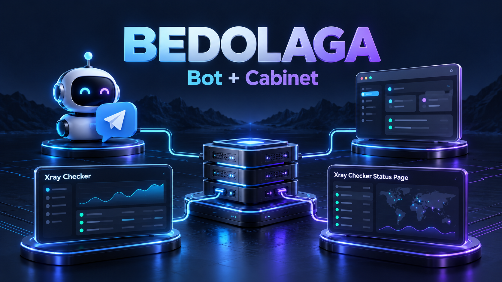
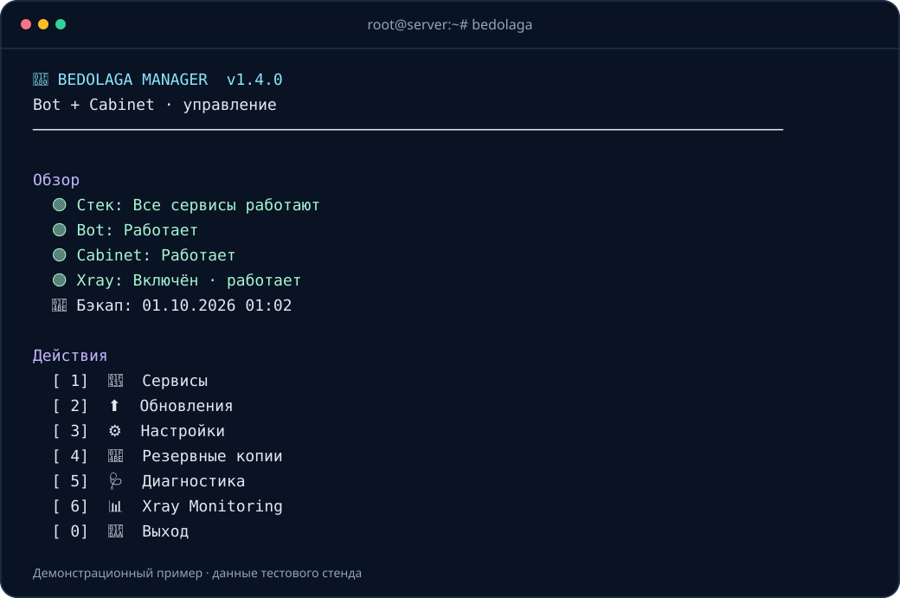

<div align="center">

# 🚀 Bedolaga Auto Installer

**Bot + Cabinet + Xray Monitoring — установка и управление из одного места**

[](https://github.com/Reibik/Auto_Install-Bedolaga_Bot/releases/latest)
[](https://github.com/Reibik/Auto_Install-Bedolaga_Bot/actions/workflows/ci.yml)
[](https://github.com/Reibik/Auto_Install-Bedolaga_Bot/actions/workflows/security.yml)
[](LICENSE)

[Установка](#quick-start) · [Меню](#management) · [Обновления](#upgrade) · [Xray](#xray) · [Руководство](docs/GUIDE.md) · [Поддержка](#support)



<sub>Концептуальная иллюстрация стека. Реальный образец меню — ниже.</sub>

</div>

**От чистого сервера до работающего проекта:** мастер настраивает Bedolaga Bot и Cabinet, разворачивает PostgreSQL, Redis и Caddy с HTTPS. После установки команда `bedolaga` открывает меню управления сервисами, обновлениями и резервными копиями.

📡 **По желанию** можно добавить Xray Checker и Xray Checker Status Page — сразу в мастере или позже, без переустановки Bot и Cabinet.

> [!IMPORTANT]
> **Remnawave Panel должна уже работать и быть доступна по API.** Этот установщик не устанавливает саму панель и не импортирует проекты, развёрнутые вручную или другим скриптом.

---

<a id="quick-start"></a>
## ⚡ Установить одной командой

На **чистом сервере** откройте Bash от имени `root` и выполните:

```bash
BEDOLAGA_REF=v1.4.0 BEDOLAGA_EXPECTED_VERSION=1.4.0 bash <(curl -fsSL https://raw.githubusercontent.com/Reibik/Auto_Install-Bedolaga_Bot/v1.4.0/install.sh)
```

Команда закреплена за стабильным **v1.4.0**, а не за изменяемой веткой `main`. Мастер проверит сервер, запросит настройки, запустит стек и проверит контейнеры.

### 📋 Перед началом

| Сервер | Что подготовить |
|---|---|
| Ubuntu **22.04 / 24.04** или Debian **12** | Telegram Bot Token и Telegram ID администраторов |
| Архитектура **AMD64 / ARM64** | URL и API key работающей Remnawave Panel |
| Минимум **1 GB RAM / 4 GB диска** | Два домена: для webhook и Cabinet |
| Рекомендуется **2 GB RAM / 10 GB диска** | A-записи доменов на IP сервера |
| Доступ `root`, свободные порты **80 / 443** | Email для TLS-сертификатов |

Для Xray Monitoring дополнительно потребуются отдельный домен и URL VPN-подписки.

<details>
<summary><strong>🧙 Что происходит во время установки?</strong></summary>

1. Проверяется ОС и устанавливаются необходимые зависимости.
2. Мастер запрашивает Telegram, Remnawave, домены, email, название проекта и часовой пояс.
3. Предлагает включить Xray Monitoring; при согласии запрашивает его настройки.
4. Username бота определяется через Telegram API, пароли и служебные секреты генерируются локально.
5. Собираются и запускаются сервисы, Caddy настраивает HTTPS.
6. Проверяется состояние контейнеров; после завершения доступна команда `bedolaga`.

Для ввода токенов есть **скрытый режим** для SSH и **видимый режим** для web-консолей. Если консоль блокирует вставку в скрытое поле, используйте видимый режим. В этом режиме секрет виден на экране — не делайте скриншоты с токенами.

</details>

> [!TIP]
> Уже установили проект **этим Manager**? Новую установку запускать не нужно — используйте [обновление](#upgrade).

---

<a id="management"></a>
## 🎛️ Одно меню для повседневных задач

```bash
bedolaga
```



<sub>Вывод настоящих функций интерфейса на тестовых данных: статусы и дата архива показаны для примера, а не сняты с рабочего сервера.</sub>

| Раздел | Что можно сделать |
|---|---|
| 🐳 **Сервисы** | Посмотреть статус и логи, запустить, остановить или перезапустить |
| ⬆️ **Обновления** | Сравнить версии, обновить Manager или приложения, выполнить откат |
| ⚙️ **Настройки** | Открыть конфигурацию, пройти мастер, применить изменения |
| 💾 **Резервные копии** | Создать архив, посмотреть список, восстановить, настроить расписание |
| 🩺 **Диагностика** | Проверить ОС, Docker, DNS, HTTPS, API и контейнеры |
| 📊 **Xray Monitoring** | Установить, обновить или отключить модуль мониторинга |

В подменю `0` или пустой Enter возвращает назад; в главном меню `0` завершает работу. При выборе сервиса `0` означает «все», а `b` — отмену.

<details>
<summary><strong>📐 Узкая консоль, цвета и эмодзи</strong></summary>

Меню подстраивается под ширину терминала в пределах 20–80 колонок. Состояния подписаны словами: интерфейс понятен и без цвета.

```bash
BEDOLAGA_UI_WIDTH=40 bedolaga       # задать ширину вручную
NO_COLOR=1 BEDOLAGA_EMOJI=0 bedolaga # минимальное оформление
```

Дата бэкапа в обзоре означает наличие непустого архива и файла SHA-256. Она не заменяет проверку checksum и пробное восстановление.

</details>

---

<a id="upgrade"></a>
## 🔄 Обновлять Manager и приложения — отдельно

| Задача | Команда | Что изменится |
|---|---|---|
| 🎛️ Обновить меню и установщик | `bedolaga self-update` | Только Manager; контейнеры приложений не пересоздаются |
| 🤖 Обновить приложения | `bedolaga update all` | Bot, Cabinet и включённый Xray; сначала создаются бэкапы |
| 📡 Обновить мониторинг | `bedolaga xray update` | Checker и Status Page настроенного модуля |

При открытии `bedolaga` Manager проверяет стабильный GitHub Release и, если есть новая версия, **показывает старую → новую версию и краткие изменения**, затем обновляется. Проверка кэшируется на час; недоступность GitHub не блокирует меню.

```bash
bedolaga self-update              # проверить и обновить Manager сейчас
bedolaga version                  # посмотреть установленную версию
BEDOLAGA_AUTO_UPDATE=0 bedolaga    # открыть меню без автообновления
```

Архив Manager проверяется по SHA-256, версии и Bash-синтаксису, проходит пробный запуск до замены рабочей установки. Обновление Manager не требует повторного мастера и не удаляет настройки или том базы.

> [!WARNING]
> Откат приложения **не отменяет миграции базы данных**. При несовместимой схеме потребуется восстановление из бэкапа. Автоматическая смена основной версии PostgreSQL также не выполняется.

<a id="whats-new"></a>
📦 **В стабильном v1.4.0:** компактное меню из шести разделов, обзор состояния и адаптация к узким консолям. [Описание релиза](https://github.com/Reibik/Auto_Install-Bedolaga_Bot/releases/tag/v1.4.0) · [История изменений](CHANGELOG.md)

---

<a id="xray"></a>
## 📡 Xray Monitoring — только если нужен

**Xray Checker** проверяет прокси из подписок, а **Xray Checker Status Page** показывает результаты на отдельном HTTPS-домене. Модуль выключен по умолчанию.

Для работающей установки через Manager:

```bash
bedolaga self-update
bedolaga xray install
```

У модуля отдельное меню, обновления и отключение с сохранением данных. Его внутренние порты не публикуются на сервере; доступ к Status Page идёт через Caddy. Данные и ключ шифрования входят в бэкапы Manager.

> [!NOTE]
> Если хотите Telegram-управление Status Page, создайте **отдельного бота**. Использовать токен основного Bedolaga Bot нельзя.

[Подробнее об устройстве и командах Xray →](docs/GUIDE.md#xray-monitoring)

---

## 💾 Настройки и данные под контролем

| Что ищете | Где находится / команда |
|---|---|
| Переменные основного бота | `/etc/bedolaga/bot.env` · `bedolaga config bot` |
| Домены и параметры стека | `/etc/bedolaga/stack.env` · `bedolaga config stack` |
| Все пути конфигурации | `bedolaga config paths` |
| Применить сохранённые изменения | `bedolaga apply` |
| Создать резервную копию | `bedolaga backup` |
| Посмотреть доступные копии | `bedolaga backup-list` |

Обычный `restart` **не перечитывает изменённые переменные окружения**: после правок используйте `apply`.

Бэкапы включают PostgreSQL, конфигурацию, постоянные данные Bot и настроенного Xray-модуля. Автоматические архивы создаются примерно в 03:00; по умолчанию сохраняются семь автоматических копий. Ручные и аварийные архивы не удаляются этой ротацией. Ошибка бэкапа останавливает обновление приложений.

> [!CAUTION]
> `.env` и резервные копии содержат секреты. Не прикладывайте их к issues и не публикуйте токены на скриншотах. Копии хранятся на том же сервере — важные архивы сохраняйте и вне сервера.

---

## 📚 Документация и помощь

| Нужен ответ | Откройте |
|---|---|
| Все команды, конфигурация, восстановление и удаление | [📘 Руководство пользователя](docs/GUIDE.md) |
| Сети, HTTPS, Docker и модель обновления | [🏗️ Архитектура](docs/ARCHITECTURE.md) |
| Что изменилось между версиями | [📝 Changelog](CHANGELOG.md) |
| Сообщить об ошибке | [🐛 Issues](https://github.com/Reibik/Auto_Install-Bedolaga_Bot/issues) |
| Сообщить об уязвимости | [🔒 Security policy](SECURITY.md) |
| Предложить улучшение | [🤝 Правила участия](CONTRIBUTING.md) |

В issue приложите версию Manager, ОС, описание проблемы и очищенные от секретов логи. Не присылайте Bot Token, API key или полный `.env`.

<details>
<summary><strong>🧪 Проверки для разработчиков</strong></summary>

```bash
for script in bedolaga install.sh tests/*.sh lib/*.sh; do bash -n "$script"; done
shellcheck -x bedolaga install.sh tests/*.sh lib/*.sh
bash tests/smoke.sh
bash tests/lifecycle.sh
bash tests/xray.sh
bash tests/ui.sh
bash tests/menu.sh
bash tests/manager-update.sh
bash tests/installer.sh
bash tests/backup.sh
```

CI проверяет Docker Compose и совместимость в Ubuntu 22.04 / 24.04 и Debian 12.

После изменения функциональности обновляйте README и руководство. Для нового меню пересоздайте иллюстрацию `node scripts/render-menu-preview.mjs`; проверить её актуальность можно через `node scripts/render-menu-preview.mjs --check`. Генератор требует Node.js и Bash с обычными Unix-утилитами; на Windows используйте Git Bash. [Исходники оформления и prompt](docs/assets/README.md).

</details>

---

<a id="support"></a>
## 💰 Поддержка

Если проект оказался полезным, можете поддержать разработку:

| Сеть | Адрес |
|---|---|
| 💎 **TON** | `UQBoEJvftr-Lz4xZoXSDRlJQbaRC_nZoMhvbi9ufeiMNLTOb` |
| 💵 **USDT TRC20** | `TRu92kG4LZ7nmubW3o31x19WagejmNt9PC` |
| ₿ **BTC** | `bc1qy82xy9sqp2kq4rvqjqrvfdl9k0s7hvy7pk3rnt` |

Перед отправкой проверьте адрес и сеть. Криптовалютные переводы необратимы. **Спасибо за поддержку! 💜**

---

## 🤝 Проекты, на которых построен стек

[🤖 Bedolaga Bot](https://github.com/BEDOLAGA-DEV/remnawave-bedolaga-telegram-bot) ·
[🖥️ Bedolaga Cabinet](https://github.com/BEDOLAGA-DEV/bedolaga-cabinet) ·
[📖 Документация Bedolaga](https://bedolagadev.mintlify.app/introduction) ·
[📡 Xray Checker](https://github.com/kutovoys/xray-checker) ·
[📊 Xray Checker Status Page](https://github.com/Mrvibecodic/xray-checker-statuspage/tree/go-build)

Manager — независимый установщик, не заменяющий документацию upstream-проектов. Его лицензия — [MIT](LICENSE); устанавливаемые сервисы сохраняют лицензии своих авторов.

<div align="center">

**Простая установка. Понятное управление.** 🚀

⭐ Если проект помогает вам — поддержите его звездой на GitHub.

</div>
