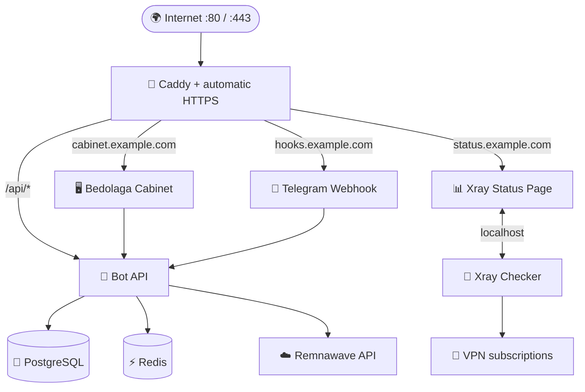

# 📘 Руководство Bedolaga Manager

[← Вернуться к README](../README.md)

Практический справочник команд, настройки, обновления и резервного копирования. Начальная установка и требования описаны в [README](../README.md#quick-start).

<a id="management"></a>
## 🎛️ Управление

Запустите интерактивное меню без аргументов:

```bash
bedolaga
```

Меню автоматически использует цвета, эмодзи и Unicode-разделители в совместимом интерактивном терминале. Для минимального ASCII-вывода:

```bash
NO_COLOR=1 BEDOLAGA_EMOJI=0 bedolaga
```

Эмодзи можно принудительно включить через `BEDOLAGA_EMOJI=1`.

### 🧭 Компактное меню управления

> [!NOTE]
> Новое меню входит в **стабильный Release v1.4.0**. Оно доступно при новой установке и после `bedolaga self-update`; обновление Manager не пересоздаёт контейнеры Bot и Cabinet.

Главный экран показывает состояние Bot и Cabinet, общую готовность стека, включение Xray и дату последнего архива с файлом SHA-256. Дата архива не заменяет проверку его целостности или пробное восстановление.

Действия сгруппированы в шесть разделов:

| Раздел | Что внутри |
|---|---|
| 🐳 **Сервисы** | Статус, запуск, остановка, перезапуск и логи выбранного сервиса |
| ⬆️ **Обновления** | Проверка версий, обновление всех приложений или отдельно Bot / Cabinet, обновление Manager и откат |
| ⚙️ **Настройки** | Редактирование Bot, стека и Caddy, пути файлов, мастер и применение изменений |
| 💾 **Резервные копии** | Создание, список, восстановление и управление ежедневными бэкапами |
| 🩺 **Диагностика** | ОС и Docker, полная проверка проекта, статусы и логи |
| 📊 **Xray Monitoring** | Отдельное меню Checker и Status Page |

`0` возвращает на уровень выше; в главном меню — завершает работу. При выборе сервиса `0` означает «все сервисы», а `b` — отмену. В подменю Enter без номера возвращает назад. Восстановление из архива по-прежнему требует явной фразы `RESTORE`.

Оформление подстраивается под ширину терминала в диапазоне 20–80 колонок. Подписи и длинные адреса переносятся без разрыва UTF-8 символов. При изменении размера окна ширина обновляется при следующем показе меню. Ширину можно задать вручную:

```bash
BEDOLAGA_UI_WIDTH=40 bedolaga
```

Зелёный означает готовность, жёлтый — ожидание или предупреждение, красный — ошибку либо опасное действие. Любое состояние также подписано текстом: штатная остановка с кодом `0`, ненулевой код завершения, пауза, перезапуск и недоступность Docker различаются.

### ✨ Автообновление Manager

При открытии меню командой `bedolaga` Manager проверяет последний **стабильный GitHub Release**. Если доступна новая версия, перед установкой показываются:

- текущая и новая версии;
- понятное направление обновления, например `v1.3.1 → v1.4.0`;
- три главных изменения из changelog нового релиза.

Обновление выполняется автоматически из опубликованного релизного архива конкретного тега. Manager проверяет SHA-256, версию внутри архива, Bash-синтаксис и пробный запуск до замены рабочей установки. Блокировки защищают от одновременных обновлений; при ошибке рабочая версия сохраняется. Недоступность GitHub не блокирует открытие меню.

Чтобы не задерживать каждый запуск, результат проверки кэшируется на один час; при недоступном GitHub меню продолжает работать. Ручная команда `self-update` не ждёт окончания этого интервала. Отключить автообновление для конкретного запуска:

```bash
BEDOLAGA_AUTO_UPDATE=0 bedolaga
```

Ручная проверка и обновление до последнего стабильного релиза:

```bash
bedolaga self-update
```

Или используйте отдельные команды:

| Команда | Назначение |
|---|---|
| `bedolaga status` | Состояние контейнеров и текущие версии |
| `bedolaga start` | Запустить весь стек |
| `bedolaga stop` | Остановить весь стек |
| `bedolaga restart [service]` | Перезапустить стек или отдельный сервис |
| `bedolaga logs [service]` | Открыть логи сервиса |
| `bedolaga doctor` | Проверить DNS, HTTPS, API и контейнеры |
| `bedolaga config wizard` | Повторно запустить мастер настройки |
| `bedolaga config bot` | Открыть конфигурацию Bot в редакторе |
| `bedolaga config stack` | Открыть системные параметры Compose |
| `bedolaga config paths` | Показать расположение всех файлов конфигурации |
| `bedolaga apply` | Применить `.env`, Caddy и branding |
| `bedolaga versions` | Сравнить локальные и доступные версии |
| `bedolaga update [all\|bot\|cabinet\|xray]` | Обновить весь проект или компонент |
| `bedolaga xray` | Открыть красивое меню Xray Monitoring |
| `bedolaga xray install` | Установить или перенастроить Xray Checker + Status Page |
| `bedolaga xray status` | Показать состояние, домен, интервал и используемые образы |
| `bedolaga xray logs [checker\|statuspage]` | Открыть логи модуля |
| `bedolaga xray update` | Обновить Checker и исходники Status Page с автоматическим откатом |
| `bedolaga xray disable` | Отключить модуль с сохранением настроек и данных |
| `bedolaga xray remove --purge-data` | Полностью удалить модуль и его данные |
| `bedolaga rollback` | Откатить последнее обновление приложений |
| `bedolaga backup` | Создать резервную копию |
| `bedolaga backup-list` | Показать доступные копии |
| `bedolaga restore <archive>` | Восстановить выбранную копию |
| `bedolaga schedule enable` | Включить ежедневные автобэкапы |
| `bedolaga firewall enable` | Настроить UFW для SSH, HTTP и HTTPS |
| `bedolaga self-update [vX.Y.Z]` | Обновить Manager до последней или указанной стабильной версии |

Доступные сервисы для `logs` и `restart`: `bot`, `cabinet`, `caddy`, `postgres`, `redis`, а при включённом модуле — `xray-statuspage` и `xray-checker`.

### 📁 Где находятся `.env` и настройки?

Конфигурация основного бота хранится в **`/etc/bedolaga/bot.env`**, а параметры Docker Compose и доменов — в **`/etc/bedolaga/stack.env`**. Это рабочие файлы Manager; редактировать `.env.example` в исходниках для настройки сервера не нужно.

```bash
bedolaga config paths    # показать все пути
bedolaga config bot      # открыть настройки бота
bedolaga config stack    # открыть параметры стека
bedolaga apply           # применить сохранённые изменения
```

> [!WARNING]
> `.env` содержит токены и пароли. Не публикуйте его и не прикладывайте к issues или скриншотам без удаления секретов.

<a id="xray-monitoring"></a>

<details>
<summary><strong>📡 Как устроен Xray Monitoring</strong></summary>

- модуль выключен по умолчанию и никак не влияет на Bot/Cabinet;
- Xray Checker получает подписки через внутренний endpoint Status Page;
- оба сервиса используют общее изолированное сетевое пространство, необходимое upstream-проекту для связи через `localhost`;
- порты `2112`, `8080`, `8081` и диапазон Xray не публикуются на host;
- пользователи открывают Status Page только по отдельному HTTPS-домену через Caddy;
- Status Page собирается из официальной ветки `go-build`, поэтому установка работает на AMD64 и ARM64;
- база, ключ шифрования и настройки Status Page хранятся в `/var/lib/bedolaga/xray-statuspage` и входят в бэкапы Manager.

Для уже работающей установки сначала обновите Manager, затем запустите:

```bash
bedolaga self-update
bedolaga xray install
```

</details>

> [!TIP]
> После изменения конфигурации используйте `bedolaga apply`. Обычный `restart` не перечитывает переменные окружения уже созданного контейнера.

---

<a id="architecture"></a>
## 🏗️ Архитектура



- наружу публикуются только `80/TCP`, `443/TCP` и `443/UDP`;
- PostgreSQL и Redis находятся во внутренней Docker-сети;
- Bot и Cabinet не публикуют host-порты напрямую;
- опциональные Xray Checker и Status Page также не публикуют host-порты;
- Caddy автоматически получает и продлевает TLS-сертификаты;
- управляемые Docker-ресурсы получают label `dev.reibik.bedolaga.managed=true`.

Подробнее: [документация по архитектуре](ARCHITECTURE.md).

---

## 🔄 Обновления и откат

Команда `bedolaga update` выполняет безопасный цикл обновления:

1. Проверяет отсутствие локальных изменений в upstream checkout.
2. Получает новые версии Bot и Cabinet.
3. Создаёт дамп PostgreSQL и бэкап конфигурации.
4. Собирает новые Docker-образы до перезапуска сервисов.
5. Запускает стек и ожидает успешные health checks.
6. При ошибке автоматически возвращает предыдущие версии приложений.

Если Xray Monitoring включён, `bedolaga update all` также создаёт бэкап, обновляет официальный image Checker и detached checkout ветки `go-build`. При неудачной сборке или health check Manager возвращает предыдущий commit Status Page и прежний image Checker.

Ручной откат:

```bash
bedolaga rollback
```

> [!WARNING]
> Откат версии приложения не отменяет миграции базы данных. Перед каждым обновлением создаётся полный бэкап; при несовместимости схемы используйте `bedolaga restore`.

---

## 💾 Резервные копии

В архив входят:

- дамп PostgreSQL в custom format;
- `stack.env`, `bot.env` и Caddyfile;
- постоянные данные, uploads и локали Bot;
- база, настройки и зашифрованные подписки Xray Status Page;
- версии Manager, Bot и Cabinet;
- SHA-256 checksum для проверки целостности.

Автобэкап запускается systemd timer примерно в `03:00`. По умолчанию хранятся семь автоматических архивов; ручные и аварийные копии автоматически не удаляются.

В v1.3.1 ошибка копирования данных, создания PostgreSQL dump перед обновлением, упаковки или расчёта checksum возвращает ошибку. Незавершённый архив и временный каталог очищаются; обновление приложений не продолжается с таким бэкапом.

---

## 🔒 Безопасность

- конфигурационные каталоги создаются с правами `700`;
- файлы с секретами создаются с правами `600`;
- секреты не передаются сторонним генераторам;
- база данных и Redis недоступны напрямую из интернета;
- UFW учитывает текущий SSH-порт перед применением правил;
- CI проверяет ShellCheck, распространённые форматы секретов и опасные shell-паттерны.

Инструкции по ответственному раскрытию уязвимостей находятся в [SECURITY.md](../SECURITY.md).

---

<details>
<summary><strong>📁 Расположение файлов на сервере</strong></summary>

```text
/usr/local/bin/bedolaga                 CLI
/usr/local/lib/bedolaga-manager/        код менеджера
/opt/bedolaga/compose.yaml              управляемый Docker Compose
/opt/bedolaga/sources/bot/              исходный код Bot
/opt/bedolaga/sources/cabinet/          исходный код Cabinet
/opt/bedolaga/sources/xray-statuspage/  ветка go-build опциональной Status Page
/etc/bedolaga/stack.env                 параметры Compose
/etc/bedolaga/bot.env                   конфигурация Bot
/etc/bedolaga/Caddyfile                 reverse proxy
/var/lib/bedolaga/bot/                  постоянные данные Bot
/var/lib/bedolaga/xray-statuspage/      данные опциональной Status Page
/var/lib/bedolaga/backups/              резервные копии
/var/lib/bedolaga/state/                состояние обновлений
```

Логотип сообщений можно заменить в `/var/lib/bedolaga/bot/vpn_logo.png` — upstream checkout останется чистым.

</details>

<details>
<summary><strong>🗑️ Безопасное удаление</strong></summary>

Удалить сервисы, сохранив данные и резервные копии:

```bash
bedolaga uninstall
```

Полностью удалить контейнеры, volumes, конфигурацию и бэкапы:

```bash
bedolaga uninstall --purge-data
```

Полное удаление необратимо и потребует ввода фразы `PURGE-BEDOLAGA`.

</details>

---
